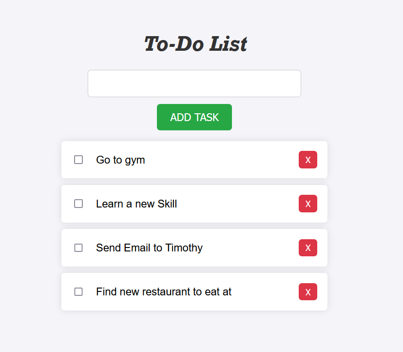

# Hyperskill-JavaScript-ToDo
A simple Website for creating a simple ToDo list, as part of the Hyperskill React/ JavaScript course from Jetbrains.
It uses a multitude of Javascript, CSS, and HTML to create dynamic unordered list with user input tasks. 

You can view and interact with a simplified version here:  
https://mzak2.github.io/Hyperskill-JavaScript-ToDo/
 

Example of site: 

  
